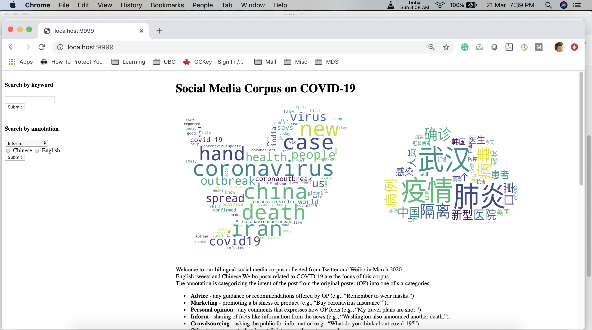

This is a group project that produced a searchable corpus from English tweets and Chinese Weibo posts related to COVID-19. The data were collected in March 2020. The annotation is categorizing the intent of the post from the original poster (OP) into one of six categories:

* Advice - any guidance or recommendations offered by OP (e.g., “Remember to wear masks.”).
* Marketing - promoting a business or product (e.g., “Buy coronavirus insurance!”).
* Personal opinion - any comments that expresses how OP feels (e.g., “My travel plans are shot.”).
* Inform - sharing of facts like information from the news (e.g., “Washington also announced another death.”).
* Crowdsourcing - asking the public for information (e.g., “What do you think about covid-19?”)
* Other/unsure - posts that do not fit into any other categorey above.

Unfortunately the Github repo is currently private. Here are some screenshots:

* Webpage interface

* Search by keyword results

* Search by annotation results

