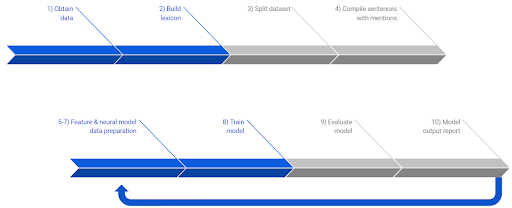

**Project Summary**

My teammates and I partnered with [Minerva Intelligence](https://minervaintelligence.com/) (Minerva) for an information extraction capstone project. Minerva’s core business is representing earth sciences information in a way that is easy to find and understand. In a domain where structured knowledge is rare, Minerva’s artificial intelligence system allows its users to easily access the information they need. The ultimate goal of this project was to build a system that can add reliable data to their knowledge base. 

Our task was to find specific geological information based solely on a report’s unstructured raw text. The B.C. Government provided 15,096 reports that were used as data for this supervised machine learning task. The target information that this project extracted for were: (1) Commodity, (2) Significant Mineral, (3) Alteration Mineral, (4) Deposit Character and (5) Dominant Host Rock. This list was compiled based on a ranking provided by Minerva.

This project explored feature-based and neural-based models. We settled on LightGBM (LGBM) for the feature-based model and Convolutional Neural Network (CNN) for the neural-based model because they performed the best in their respective categories. Since Minerva values precision, the ratio of correct predictions out of all predictions, evaluation was mainly based on how often models can correctly label a term True. Even though LGBM consistently outperformed CNN, the difference was not significant and Minerva showed great interest in neural models. Therefore, the project proceeded with the two types of models even though the final deliverable was LGBMs only.
 
For the LGBM, we engineered linguistic features, analyzed how models used these features, fine-tuned model hyperparameters, and examined precision and recall tradeoffs. For the CNN, experiments included trying pre-trained and self-trained word embeddings and adding features to the input that were more than just words in the text. 

When assessed on evaluation datasets, the final Commodity LGBM model achieved over 92% precision with equally high recall. The best Commodity CNN model performed slightly worse than its feature-based counterpart with 91% precision. Commodity models are certainly the best performing classifiers. The worst field is Alteration Mineral, which had a precision around 75% for LGBM and approximately 65% for CNN. Overall, the feature-based models are more precise than the neural-based ones by 1% to 7%. However, given that the best CNNs only had words and two additional features as input, there is great potential in developing a neural model that will outperform the best LGBM model, which had over 10 linguistic features as input.

**The Project Pipeline**

* Webpage interface
